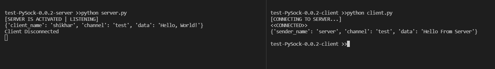

A python  package for creating multi-client server with high level of abstarction, meaning user don't need to write 100s of lines of code. User can write a multi-client server with just 12 lines fo code, it's that simple.
In addition to this PySock also make the connections end-to-end encrypted. It also provide the functionality of creating a end-to-end encrypted connection between two or more client, meaning client can share the data with others client available.

---

><h4 style = "color : #7264a3">Sample Server</h4>

Before creating server make sure you have a .yaml file as it is required

server.py

```python
1  import PySock
2
3  def sample_func(data,con):
4          print(data)
5          con.SEND("test",data["client_name"],"Hello From Server")
6
7  s = PySock.server(secure = True, file = r'server.yaml')
8  s.SERVER(address = "localhost", port = 1234, listeners = 10)
9  s.CREATE_CHANNEL("test")
10
11  while True:
12          s.LISTEN(channel = "test", function = sample_func,args = (s,))
```

### Code Explaination
Starts with line one we import the PySock module, after that in line three we created a sample function which will be executed when someone send something to server ( Used with `.LISTEN()` ). There is one special feature of this function which is it should have a argument with name `'data'`. User don't need to pass any information to this argument when executing it with `.LISTEN()` method, this is enough for now we will discuss about this in line 12 breafly. In line 4 we just print data, type of data is python dict with structure something like that : `{sender_name : "client1", channel : "test", data : "Hello, World!"}`
then in line 5 we send `"Hello From Server"` to the client so send the data to server, basically it is like a echo server.
Now Come the main part, heart of the server. In line 7 we initilize the `PySock.server()` class which is responsible for basic configuration of the server. `.server()` takes two argument one is `secure` which is default set to `True` and it should be set to True, second argument is `file` if you have specified `secure = True` then it is neccessary to pass a `.yaml` file as this file contains all the configuration and key for encrypted server.
Now in line 8 we create the server by passing comman server information like address, port, listeners. In line 9 we created a channel through which server can send and receive the data with client. In line 11 we spin up a infite while loop and with the help of this we can receive the data from clients. Now comes the line 12 which is responsible for listening to upcoming data. The`.LISTEN()` method takes three arguments first one is 'channel' on which it can listen for data second is 'function' it requires a function which has atleast one argument 'data' through which it can pass the information which is send by client to function, the third and last argument is optional which is 'args' user can pass tuple of arguments for function. 


><h4 style = "color : #7264a3">Sample Client</h4>


Before creating server make sure you have a .yaml file as it is required

client.py

```python
1  import PySock
2 
3  run = True
4
5  def sample_func(data):
6     global run
7     print(data)
8     run = False
9
10  c = PySock.client(
11     client_name=  "shikhar",
12     DSP_enable= True,
13     file = r'client.yaml',
14     debug = True,
15     rememberServer = True
16     )
17  c.CLIENT("localhost",1234)
18  c.CREATE_CHANNEL("test")
19  c.SEND(channel = "test", data = "Hello, World!")
20  while run:
21      c.LISTEN("test",sample_func)
```

### Code Explaination

I will not going to explain about the `imports` and the `sample_func` becouse i have already explain it in the server section. There is only a slite change it the `sample_func` as it use the `global run` to break the while loop after receiving the data from server. It is not comlupsory to break the while but as client you don't want your script to run forever.
Coming to line 10, here we initilize the `PySock.client()` for configuration purposes. It takes five arguments first is 'client_name' as you have understand with the name you have to give the name to the client you have initilize. There is a small problem with this kind of approch. The problem is that client name should be unique and after reading this you things huff, there is no big deal in this think, i will name it uniquely. But it is not in your hand becouse someone sitting in the other part of the world will give name to the client same as you and the server will confuse which information is of which client.
Server create a encrypted pipe for sending and receiving informations and with the help of hashed client name it identifies the pipe. THIS IS SOMETHING WE WILL TRY TO SOLVE IN THE UPCOMING NEW RELEASE.
Now comes the line 18, here we create the client. The `.CLIENT()` will takes three argument first is `address` and second is `port` i think there is no need to explain these two, it is understandable. The third argument is `timeout` it is optional but very inportant, it takes integers as seconds and basicaly the concept behind timeout is that the natural behavior of `.CLIENT()` is blocking so the timeout is maximum time for which the client can wait to get response from server. Now in line 19 we send the string `Hello, World!` to server using the channel we have created previousely. After that we just run a infinite while loop for listening for incoming data using `.LISTEN()` it works completely same as the `server's` `.LISTEN()`.

### Result after running server.py and client.py



Thank you!

---